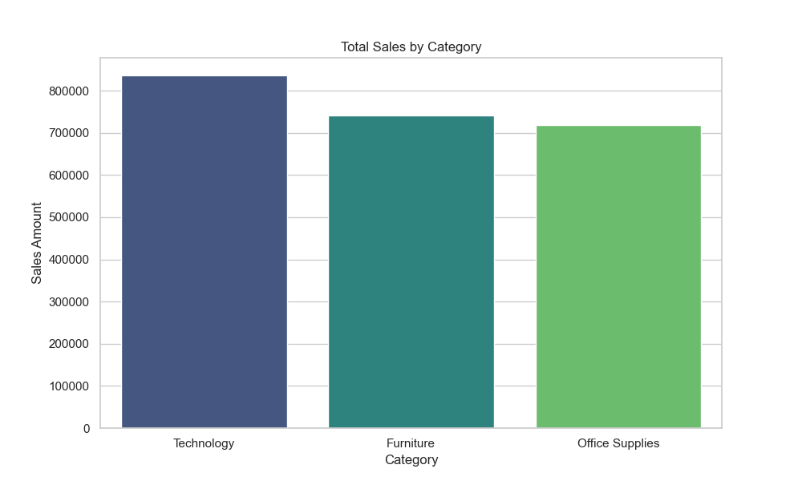
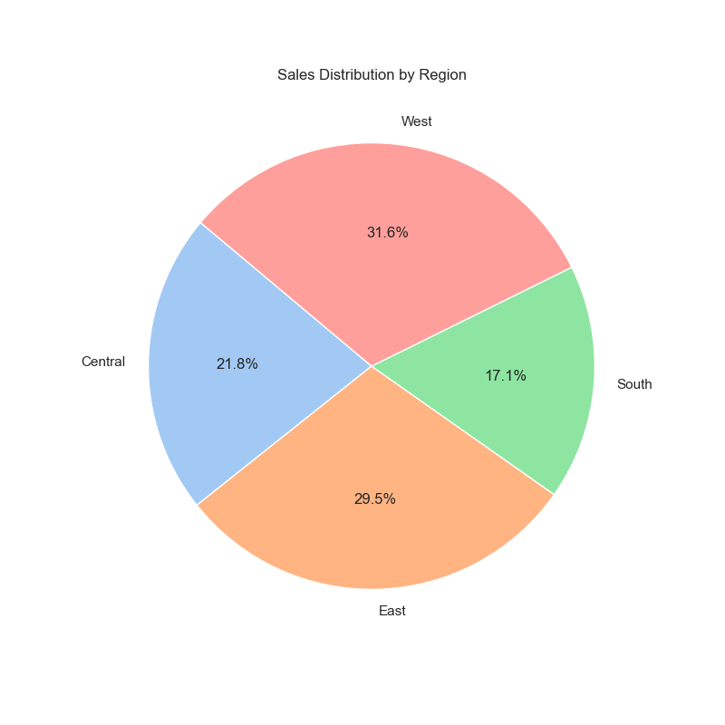

# Superstore Sales Analysis 📊

## Project Overview
This project is part of the **Coding Samurai Data Science Internship (Level 1)**. 
The objective is to analyze retail sales data to identify trends, top-selling categories, and regional performance.

## Dataset
The "Sample Superstore" dataset includes:
- **Order Date**: Date of purchase
- **Category**: Product category (Furniture, Office Supplies, Technology)
- **Region**: Geographic region of the store
- **Sales**: Revenue generated
- **Profit**: Net profit earned

## Tech Stack
- **Python**: Core language
- **Pandas**: Data cleaning and aggregation
- **Matplotlib & Seaborn**: Data visualization

## Key Insights
- **Top Category**: Technology products generate the highest revenue.
- **Regional Performance**: The West region contributes the largest share of sales (approx 32%).
- **Profitability**: While Tables (Furniture) have high sales, they often show negative profit margins compared to Copiers (Technology).

## Visualizations
### Sales by Category

### Regional Distribution

## How to Run
1. Clone the repository.
2. Install dependencies: `pip install pandas matplotlib seaborn`
3. Run the notebook `sales_analysis.ipynb`.