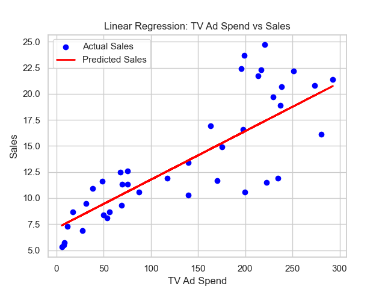

# Linear Regression on Advertising Data 📈

## Project Overview
This project is part of the **Coding Samurai Data Science Internship (Level 1)**. 
The goal is to build a simple linear regression model to predict sales based on advertising budgets (TV, Radio, Newspaper).

## Dataset
The dataset consists of 200 records with the following columns:
- **TV**: Ad budget for TV (in thousands of dollars)
- **Radio**: Ad budget for Radio
- **Newspaper**: Ad budget for Newspaper
- **Sales**: Sales revenue (Target Variable)

## Tech Stack
- **Python**: Core language
- **Pandas**: Data manipulation
- **Seaborn/Matplotlib**: Data visualization
- **Scikit-Learn**: Machine Learning (Linear Regression)

## Key Results
- **Correlation**: TV ad spending showed the strongest correlation with Sales.
- **Model Accuracy**: The model achieved an R2 score of approximately **0.67** (when using TV data alone).

## Visualizations

*(Ensure you actually save the image in the images folder as shown in the code)*

## How to Run
1. Clone the repository.
2. Install dependencies: `pip install pandas matplotlib seaborn scikit-learn`
3. Run the notebook `linear_regression.ipynb`.