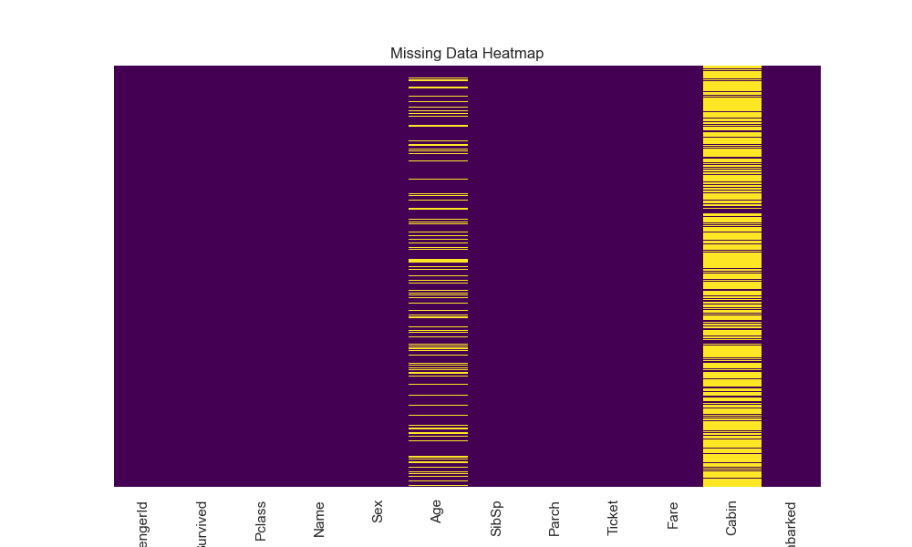
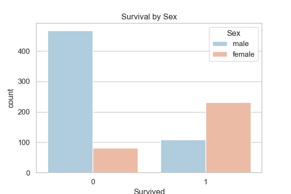
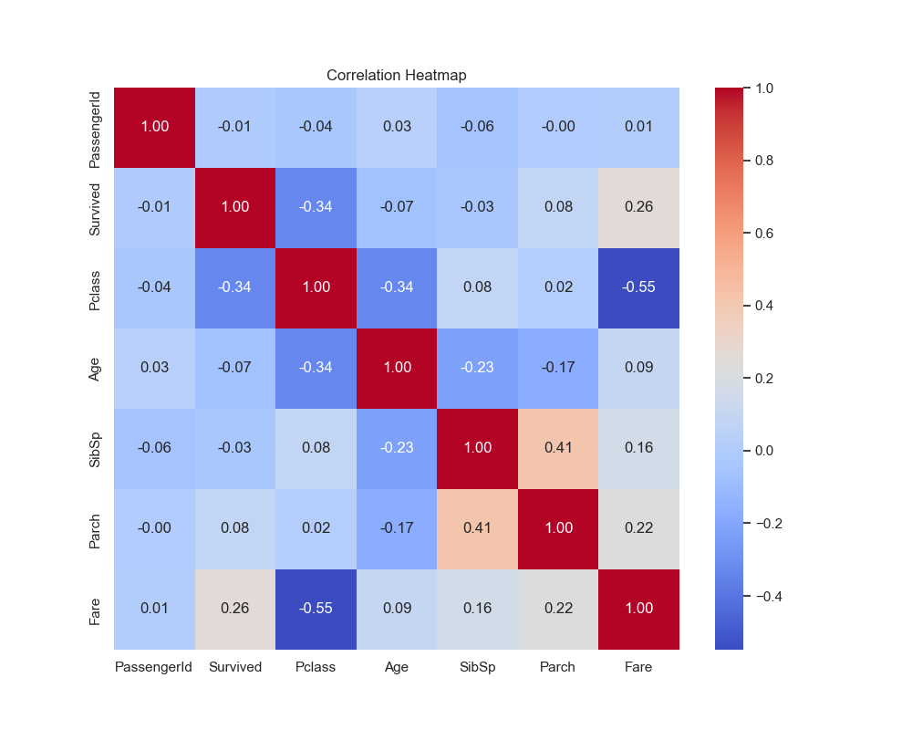
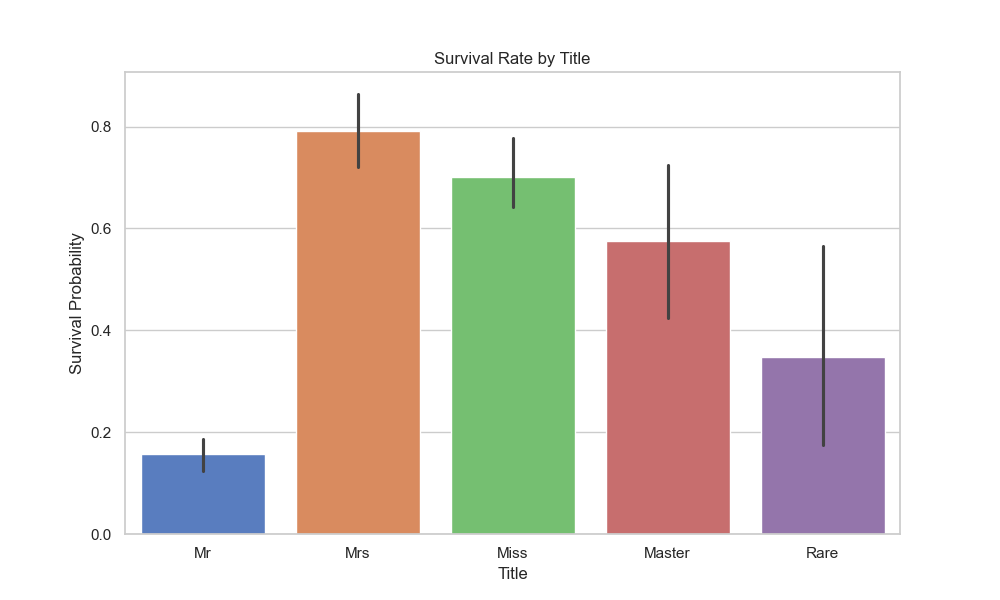
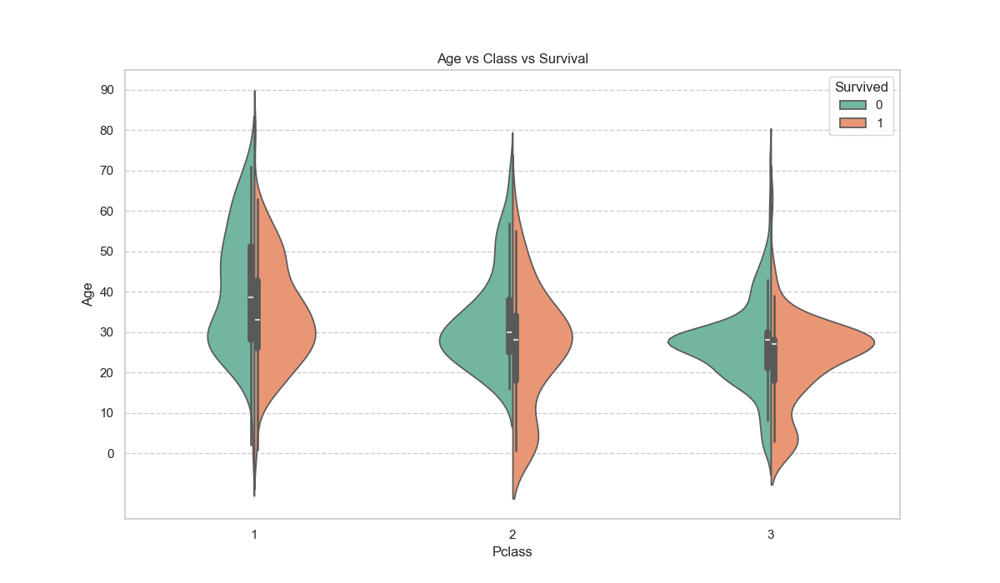

# Exploratory Data Analysis (EDA) on Titanic Dataset 🚢

## Project Overview
This project is part of the **Coding Samurai Data Science Internship (Level 2)**. 
The goal is to perform Exploratory Data Analysis (EDA) on the famous Titanic dataset to understand the demographics of the passengers and identify factors that influenced survival rates.

## Dataset
The dataset includes information such as:
- **Survived**: 0 = No, 1 = Yes
- **Pclass**: Ticket class (1st, 2nd, 3rd)
- **Sex**: Gender
- **Age**: Age in years
- **SibSp/Parch**: Number of siblings/spouses or parents/children aboard

## Key Insights
1.  **Gender**: Female passengers had a significantly higher chance of survival compared to males.
2.  **Class**: 1st Class passengers had the highest survival rate, while 3rd Class had the lowest.
3.  **Age**: The age distribution is slightly right-skewed, with the majority of passengers being between 20-30 years old.

## Visualizations
### Missing Data Heatmap

### Survival by Gender

### Correlation Heatmap

### Feature Engineering
- **Title Extraction**: Extracted titles (Mr, Mrs, Miss) from names to analyze social status.
- **Family Size**: Combined siblings and parents counts to analyze if family size affected survival.

### Advanced Visualizations

*Women (Mrs/Miss) and Boys (Master) had much higher survival rates.*

*Multivariate analysis of Age, Class, and Survival status.*

## How to Run
1. Clone the repository.
2. Install dependencies: `pip install pandas matplotlib seaborn`
3. Run the notebook `titanic_eda.ipynb`.