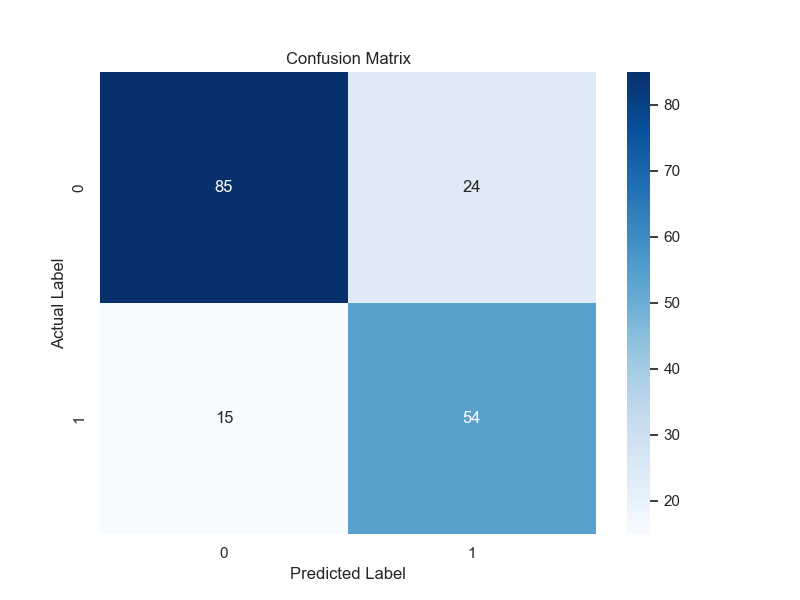
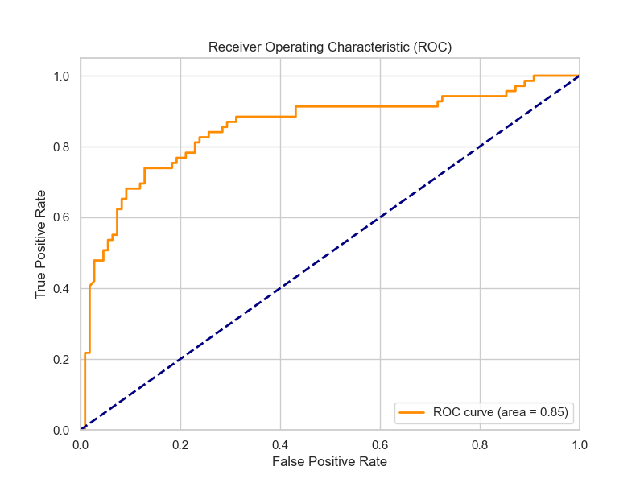
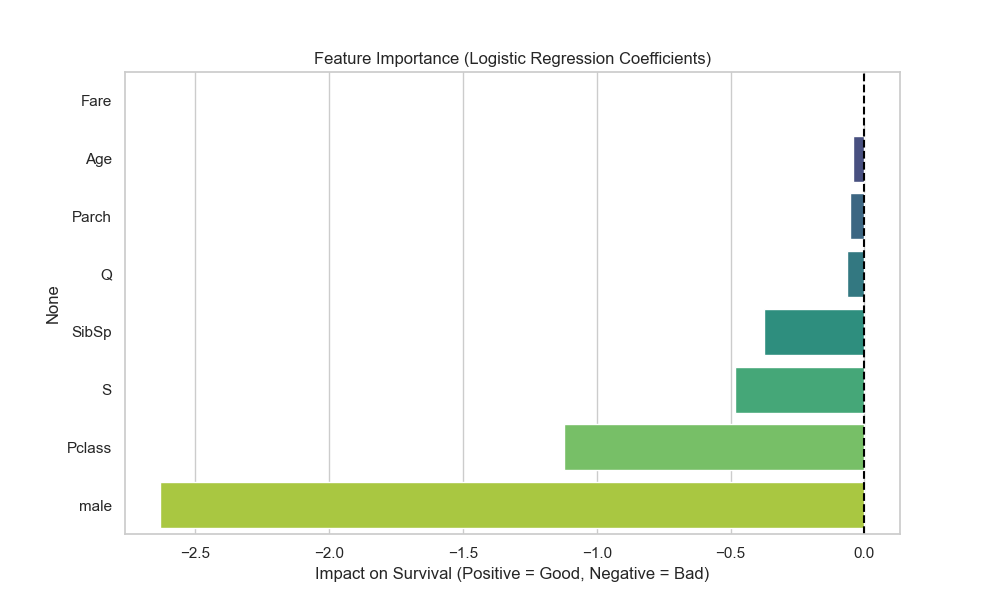

# Titanic Survival Prediction (Logistic Regression) 🚢

## Project Overview
This project is part of the **Coding Samurai Data Science Internship (Level 2)**. 
We built a **Logistic Regression** model to predict whether a passenger on the Titanic would survive based on features like Age, Class, and Gender.

## Dataset
Used the standard Titanic dataset.
- **Preprocessing**: 
    - Filled missing 'Age' values with the median.
    - Dropped 'Cabin' due to missing data.
    - Encoded categorical variables ('Sex', 'Embarked') into numerical dummy variables.

## Model Performance
- **Model Used**: Logistic Regression
- **Accuracy**: ~81% (May vary slightly based on split)
- **Key Findings**: Gender and Passenger Class were the strongest predictors of survival.

## Visualizations
### Confusion Matrix

*Shows the number of Correct vs. Incorrect predictions.*

### ROC Curve

*Performance metric showing the True Positive Rate vs False Positive Rate.*

### Advanced Model Tuning
- **Cross-Validation**: Implemented 10-Fold CV to verify model stability (Mean Accuracy: ~80%).
- **Hyperparameter Tuning**: Used `GridSearchCV` to optimize solver and regularization strength.

### Feature Importance

*Visualizes which factors contributed most to survival. "Sex_male" and "Pclass" had the strongest negative impact.*

## How to Run
1. Clone the repository.
2. Install dependencies: `pip install pandas sklearn seaborn matplotlib`
3. Run `titanic_logistic.ipynb`.