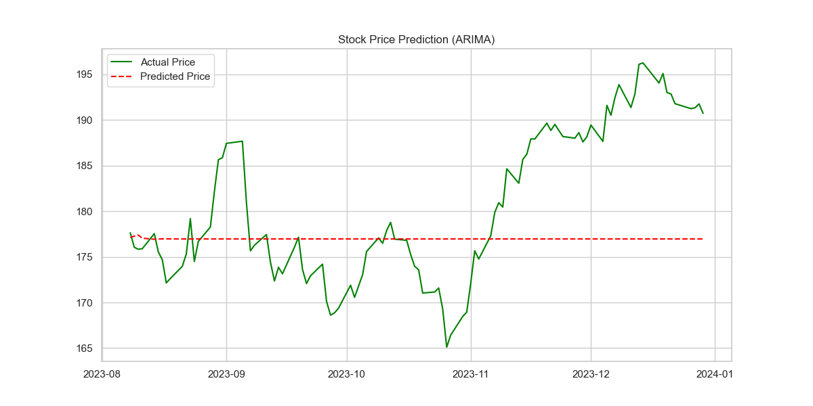
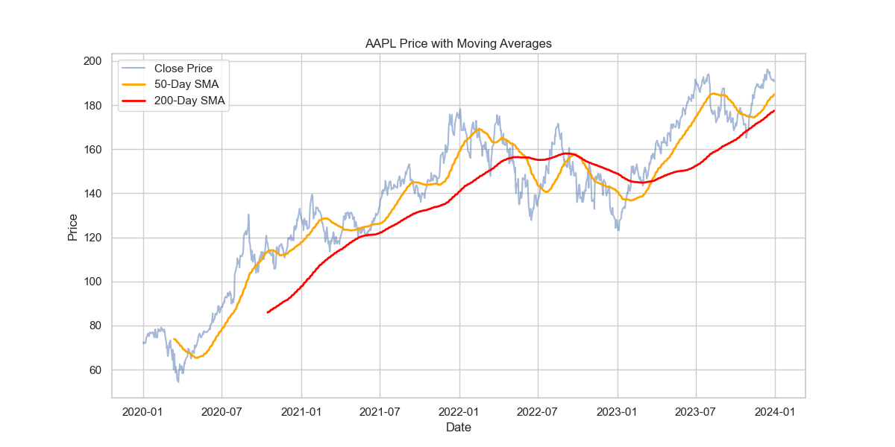
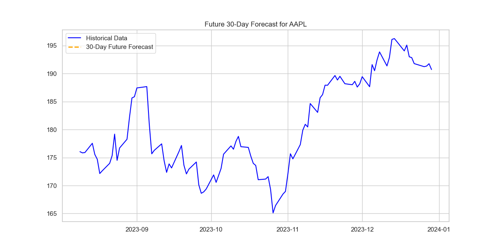

# Stock Price Forecasting (ARIMA) 📈

## Project Overview
This project is part of the **Coding Samurai Data Science Internship (Level 3)**. 
We used historical stock data (fetched via `yfinance`) to build an **ARIMA** model that predicts future stock prices.

## Dataset
- **Source**: Yahoo Finance API (Real-time data)
- **Ticker**: AAPL (Apple Inc.)
- **Period**: Jan 2020 - Jan 2024
- **Target**: 'Close' price (Daily closing value)

## Tech Stack
- **Python**: Core language
- **yfinance**: Data extraction
- **Statsmodels**: ARIMA modeling
- **Matplotlib**: Visualization

## Key Results
- **Model**: ARIMA (5,1,0)
- **Performance**: The model successfully captured the general trend of the stock movements on the test set.
- **Future Forecast**: Generated a prediction for the next 30 business days.

## Visualizations
### Actual vs Predicted (Test Set)

*The red dashed line shows the model's prediction compared to actual market performance.*

### Advanced Statistical Analysis
- **Decomposition**: Broke down the time series into Trend, Seasonality, and Residual components.
- **Stationarity Test**: Performed the Augmented Dickey-Fuller (ADF) test.
    - *Result*: Raw prices were non-stationary, confirming the need for the Integrated (d=1) component in ARIMA.

### Technical Indicators

*Analyzed 50-day and 200-day Simple Moving Averages (SMA) to identify market trends.*śś

### Future 30-Day Forecast

## How to Run
1. Clone the repository.
2. Install dependencies: `pip install pandas yfinance statsmodels matplotlib`
3. Run `stock_forecasting.ipynb`.