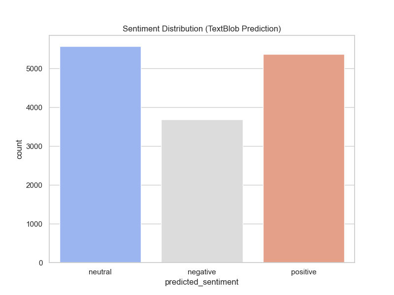
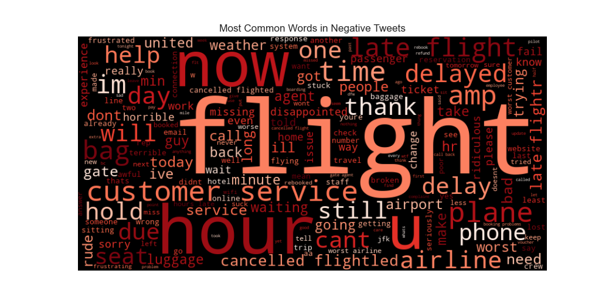
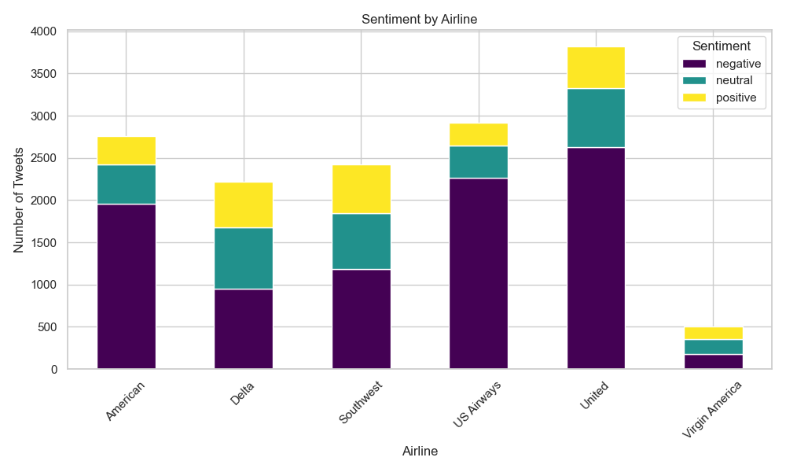
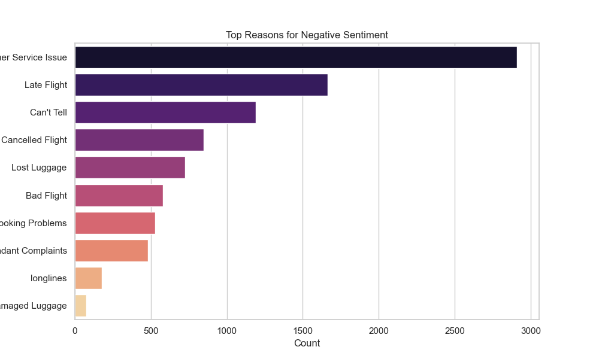
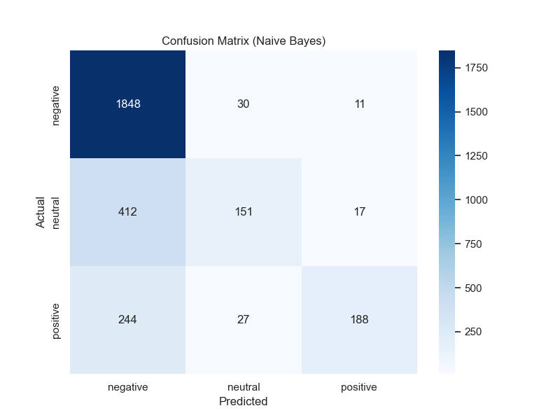

# Sentiment Analysis on Social Media Data 🐦

## Project Overview
This project is part of the **Coding Samurai Data Science Internship (Level 3)**. 
The objective was to analyze social media data (tweets regarding US Airlines) to detect sentiment patterns and provide actionable business intelligence using Natural Language Processing (NLP).

## Dataset
- **Source**: Twitter US Airline Sentiment (Kaggle)
- **Content**: 14,000+ tweets classified as Positive, Negative, or Neutral.
- **Key Columns**: `text`, `airline_sentiment`, `airline`, `negativereason`.

## Methodology
1.  **Data Preprocessing**: cleaned raw text by removing user handles, hashtags, URLs, and special characters.
2.  **Lexicon-Based Analysis**: Used **TextBlob** to generate initial polarity scores.
3.  **Machine Learning**: Built a **Naive Bayes** classifier using **TF-IDF Vectorization** to predict sentiment with higher accuracy.
4.  **Root Cause Analysis**: Investigated the specific reasons behind negative feedback.

## Key Business Insights 💡
- **Competitor Analysis**: 
    - **United** and **US Airways** received the highest volume of negative tweets.
    - **Virgin America** had the healthiest Positive-to-Negative ratio.
- **Root Cause**: 
    - The #1 driver of negative sentiment was **"Customer Service Issue"**, followed closely by **"Late Flight"**.
    - "Lost Luggage" was a significantly smaller issue compared to service complaints.
- **Model Performance**: 
    - The Naive Bayes model achieved an accuracy of **~78%**.
    - The Confusion Matrix reveals the model is highly effective at identifying negative complaints but occasionally struggles to distinguish between Neutral and Positive tweets.

## Visualizations 📊

### 1. Sentiment Distribution

*Overall, the dataset is heavily skewed towards negative sentiment.*

### 2. Negative Word Cloud

*Common words in angry tweets include "cancelled", "delayed", "hour", and "hold".*

### 3. Competitor Analysis (Sentiment by Airline)

*A breakdown of sentiment proportions across different airlines.*

### 4. Root Cause Analysis

*Ranking the specific reasons why customers complained.*

### 5. Model Evaluation (Confusion Matrix)

*Visualizing True vs. Predicted labels for the Machine Learning model.*

## Tech Stack
- **Python**: Core language
- **Pandas**: Data manipulation and aggregation
- **TextBlob**: Rule-based sentiment analysis
- **Scikit-Learn**: Machine Learning (Naive Bayes, TF-IDF)
- **WordCloud**: Text visualization
- **Seaborn/Matplotlib**: Statistical plotting

## How to Run
1. Clone the repository.
2. Install dependencies:
   ```bash
   pip install pandas matplotlib seaborn wordcloud textblob nltk sklearn